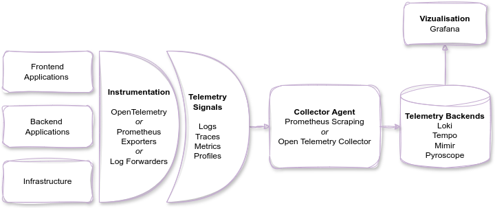

# Observability with OpenTelemetry and Prometheus - A Curated Implementation Guide

- [Observability with OpenTelemetry and Prometheus - A Curated Implementation Guide](#observability-with-opentelemetry-and-prometheus---a-curated-implementation-guide)
  - [1. Purpose of this guide](#1-purpose-of-this-guide)
  - [2. Overall Architecture](#2-overall-architecture)
    - [External resources](#external-resources)
  - [3. Instrumentation](#3-instrumentation)
    - [3.1 Infrastructure](#31-infrastructure)
      - [3.1.1 Kubernetes clusters](#311-kubernetes-clusters)
      - [3.1.2 Docker hosts](#312-docker-hosts)
      - [3.1.3 Linux Hosts](#313-linux-hosts)
      - [3.1.4 Windows Hosts](#314-windows-hosts)
      - 

## 1. Purpose of this guide

Observability in modern systems is complex with the rise of distributed cloud native systems.

This guide shows a curated approach to implementing observability using the open standards that are Prometheus and OpenTelemetry. Adopting these standards ensure vendor agnosticity in the way to ship telemetry data.

To obtain a concrete implementation that can run at scale, the Grafana Ecosystem will be used to store and analyze the data. We will be using Loki (Logs), Grafana (Vizualisation), Tempo (Traces), Mimir (Prometheus Metrics), Pyroscope (Profiles).

To follow this guide you can choose 
 - the Open Source route by running all the components yourself
 - the Hosted Grafana Cloud version using the forever Free Tier : [Create a Grafana Cloud Free Account](https://grafana.com/auth/sign-up/create-user?pg=otelpromguide)

## 2. Overall Architecture

### External resources
 - Links to come here here

## 3. Instrumentation

### 3.1 Infrastructure

#### 3.1.1 Kubernetes clusters

#### 3.1.2 Docker hosts

#### 3.1.3 Linux Hosts

#### 3.1.4 Windows Hosts

### 4. 

