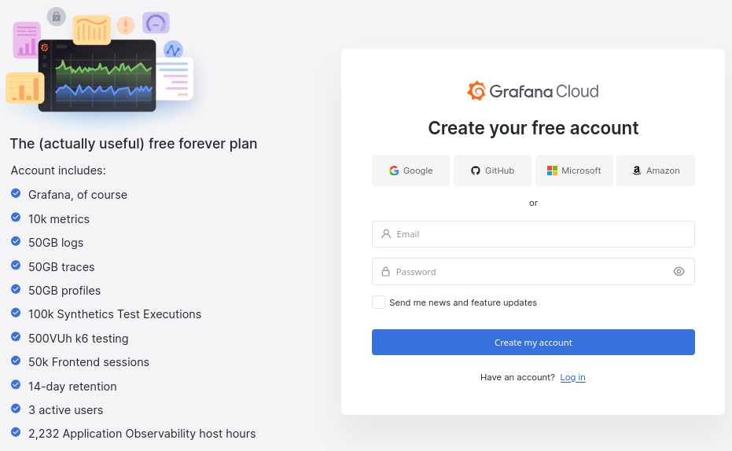

# Observability with OpenTelemetry and Prometheus - A Curated Implementation Guide

- [Observability with OpenTelemetry and Prometheus - A Curated Implementation Guide](#observability-with-opentelemetry-and-prometheus---a-curated-implementation-guide)
  - [1. Purpose of this guide](#1-purpose-of-this-guide)
  - [2. Overall Architecture](#2-overall-architecture)
  - [3. Setup Grafana Observability Platform](#3-setup-grafana-observability-platform)
    - [3.1 Using Grafana Cloud](#31-using-grafana-cloud)
    - [3.2 Open Source](#32-open-source)
      - [3.2.1 All in one Docker container](#321-all-in-one-docker-container)
      - [3.2.1 The hard way! Run each component separately](#321-the-hard-way-run-each-component-separately)
  - [4. Instrumentation](#4-instrumentation)
  - [](#)
    - [4.1 Infrastructure](#41-infrastructure)
      - [4.1.1 Kubernetes clusters](#411-kubernetes-clusters)
      - [4.1.1 Apps from Open Telemetry Demo](#411-apps-from-open-telemetry-demo)
      - [4.1.2 Linux Docker hosts](#412-linux-docker-hosts)
      - [4.1.3 Linux Hosts](#413-linux-hosts)
      - [4.1.4 Windows Hosts](#414-windows-hosts)
    - [4. Backend Application](#4-backend-application)
    - [4. Frontend Application](#4-frontend-application)
  - [Observability Assets](#observability-assets)
    - [Grafana Cloud](#grafana-cloud)
    - [Open Source assets](#open-source-assets)


## 1. Purpose of this guide

Observability in modern systems is complex with the rise of distributed cloud native systems.

This guide shows a curated approach to implementing observability using the open standards that are Prometheus and OpenTelemetry. Adopting these standards ensure vendor agnosticity in the way to ship telemetry data.

To obtain a concrete implementation that can run at scale, the Grafana Ecosystem will be used to store and analyze the data. We will be using Loki (Logs), Grafana (Vizualisation), Tempo (Traces), Mimir (Prometheus Metrics), Pyroscope (Profiles).

To follow this guide you can choose 
- the Open Source route by running all the components yourself
- the Hosted Grafana Cloud version using the forever Free Tier : [Create a Grafana Cloud Free Account](https://grafana.com/auth/sign-up/create-user?pg=otelpromguide)

## 2. Overall Architecture


## 3. Setup Grafana Observability Platform

### 3.1 Using Grafana Cloud 

Grafana Cloud is SaaS offering with turnkey solutions for
- Infrastructure observability
- Backend and frontend application observability
- AI/ML assisted root cause analysis
- Performance & load testing
- Synthetic monitoring
- On call & incident response management


Go to grafana.com and create a free account here : [Grafana Cloud Free Account](https://grafana.com/auth/sign-up/create-user?pg=otelpromguide)



### 3.2 Open Source

#### 3.2.1 All in one Docker container

For development purposes you can use the all in one otel-lgtm docker image : 
[Docker OTEL-LGTM git repo](https://github.com/grafana/docker-otel-lgtm)


```bash
docker run --name lgtm -d -p 3000:3000 \
  -p 4317:4317 \
  -p 4318:4318 \
  -p 9090:9090 \
  -p 4417:4417 \
  -p 4418:4418 \
  -p 3100:3100 \
  -p 4040:4040 \
  grafana/otel-lgtm
```

You can also run it in kubernetes. Again, this is really just for development purposes not intended for production workloads.

```sh
kubectl apply -f https://raw.githubusercontent.com/alainpham/observability-with-opentelemetry-and-prometheus/refs/heads/master/src/lgtm.k8s.yaml -n default
```

#### 3.2.1 The hard way! Run each component separately

If you want to deploy it the hard way at scale, you can also follow documentation of each component and deploy them separately.

 - [Grafana Vizualization](https://grafana.com/docs/grafana/latest/setup-grafana/installation/)
 - [Prometheus](https://prometheus.io/docs/prometheus/latest/installation/)
 - [Loki](https://grafana.com/docs/loki/latest/setup/install/)
 - [Tempo](https://grafana.com/docs/tempo/latest/setup/)
 - [Pyroscope](https://grafana.com/docs/pyroscope/latest/get-started/)


## 4. Instrumentation

To instrument infrastructure and applications will rely on :
- Grafana Alloy is an all in one binary to build ingestion piplelines that can be composed of various components ([docs](https://grafana.com/docs/alloy/latest/))
  - Prometheus exporters
  - Open Telemetry Collector
  - Continuous profiling instrumentation
  - EBPF based instrumentation for producing OTEL traces
- OpenTelemetry SDK's to instrument the code in various programming languages. ([docs](https://opentelemetry.io/docs/languages/))

For the following sections we will require these env vars that define the different endpoints and credentials for the collectors to send data to the telemetry backends

##
 4.1

```sh
export KUBE_CLUSTER_NAME=sandbox
export ALLOY_NAMESPACE=default

export PROM_URL=http://lgtm:9090
export PROM_REMOTEWRITE_PATH=/api/v1/write
export PROM_PATH_FOR_OPENCOST=/api/prom
export PROM_USER=promuser
export PROM_PASSWORD=prompassword

export LOKI_URL=http://lgtm:3100
export LOKI_USER=lokiuser
export LOKI_PASSWORD=lokipassword

export OTLP_URL=http://lgtm:4318
export OTLP_USER=otlpuser
export OTLP_PASSWORD=otlppassword

export PROFILES_URL=http://lgtm:4040
export PROFILES_USER=profilesuser
export PROFILES_PASSWORD=profilespassword

export GCLOUD_FARO=https://faro-collector-prod-eu-west-2.grafana.net/collect/TOKEN
```

### 4.1 Infrastructure

#### 4.1.1 Kubernetes clusters

Grafana provides a helm chart to deploy Grafana Alloy on Kubernetes clusters. 

These instances of Grafana Alloy also expose an OpenTelemetry Collector endpoint to receive metrics, logs and traces of applications deployed on that cluster that are instrumented with the OTEL SDK's. This ensures that application and infra data can be correlated out of the box.


Here is a quickstart [install script](src/alloy-k8s-deploy.sh) with values for the most common usage on a vanilla k8s cluster.

```bash
# comma separated list of namespaces
export APP_NAMESPACES=apps,java-apps

# download and execute alloy helm chart including default values
curl -L https://raw.githubusercontent.com/alainpham/observability-with-opentelemetry-and-prometheus/refs/heads/master/src/alloy-k8s-deploy.sh | sh
```

Links to different resources : 
- [Documentation of Helm Chart](https://github.com/grafana/k8s-monitoring-helm/blob/main/charts/k8s-monitoring/README.md)
- [Examples of Helm chart value files](https://github.com/grafana/k8s-monitoring-helm/tree/main/charts/k8s-monitoring/docs/examples)


#### 4.1.1 Apps from Open Telemetry Demo

Run these commands to deploy the otel demo preconfigured to send otlp data to alloy deployed with the k8s monitoring helm chart.

```sh
# otel demo yaml
wget -O /tmp/oteldemo.yaml https://raw.githubusercontent.com/alainpham/observability-with-opentelemetry-and-prometheus/refs/heads/master/src/oteldemo/oteldemo.yaml 

envsubst '${GCLOUD_FARO} ${ALLOY_NAMESPACE}' < /tmp/oteldemo.yaml| kubectl apply -n otel-demo -f -

# optional ingress
wget -O /tmp/expose.yaml https://raw.githubusercontent.com/alainpham/observability-with-opentelemetry-and-prometheus/refs/heads/master/src/oteldemo/oteldemo/expose.yaml

envsubst < /tmp/expose.yaml | kubectl apply -n otel-demo -f -
```

#### 4.1.2 Linux Docker hosts

TODO

#### 4.1.3 Linux Hosts

Download alloy binary relevant to your linux distribution :

https://github.com/grafana/alloy/releases

Here is an example on debian based distributions

```sh
curl -Lo /tmp/alloy.deb https://github.com/grafana/alloy/releases/download/v1.12.0/alloy-1.12.0-1.amd64.deb

sudo apt install /tmp/alloy.deb
```

Populate configuration files, verify the following [file](src/alloy-linuxhost-config.alloy) that configure the node exporter metrics and opens up endpoints to receive OTLP, prom remotewrite and loki apis.

```sh
# setup aloy config file
sudo curl -Lo /etc/alloy/config.alloy https://raw.githubusercontent.com/alainpham/observability-with-opentelemetry-and-prometheus/refs/heads/master/src/alloy-linuxhost-config.alloy

# set endpoints env vars and credientials
cat<<EOF | sudo tee /etc/default/alloy
CONFIG_FILE="/etc/alloy/config.alloy"
CUSTOM_ARGS=""
RESTART_ON_UPGRADE=true

KUBE_CLUSTER_NAME=${KUBE_CLUSTER_NAME}
ALLOY_NAMESPACE=${ALLOY_NAMESPACE}

PROM_URL=${PROM_URL}
PROM_REMOTEWRITE_PATH=${PROM_REMOTEWRITE_PATH}
PROM_PATH_FOR_OPENCOST=${PROM_PATH_FOR_OPENCOST}
PROM_USER=${PROM_USER}
PROM_PASSWORD=${PROM_PASSWORD}

LOKI_URL=${LOKI_URL}
LOKI_USER=${LOKI_USER}
LOKI_PASSWORD=${LOKI_PASSWORD}

OTLP_URL=${OTLP_URL}
OTLP_USER=${OTLP_USER}
OTLP_PASSWORD=${OTLP_PASSWORD}

PROFILES_URL=${PROFILES_URL}
PROFILES_USER=${PROFILES_USER}
PROFILES_PASSWORD=${PROFILES_PASSWORD}

GCLOUD_FARO=${GCLOUD_FARO}
EOF


sudo systemctl enable alloy.service
sudo systemctl start alloy.service
```

#### 4.1.4 Windows Hosts

TODO

### 4. Backend Application

TODO

### 4. Frontend Application

TODO

## Observability Assets

### Grafana Cloud

### Open Source assets